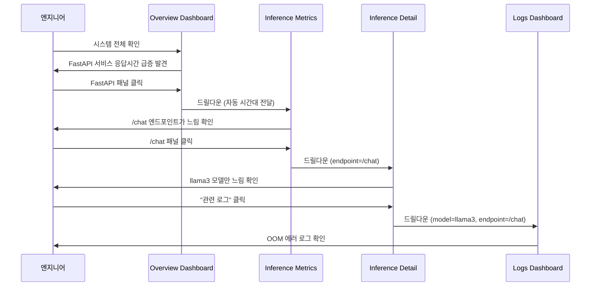
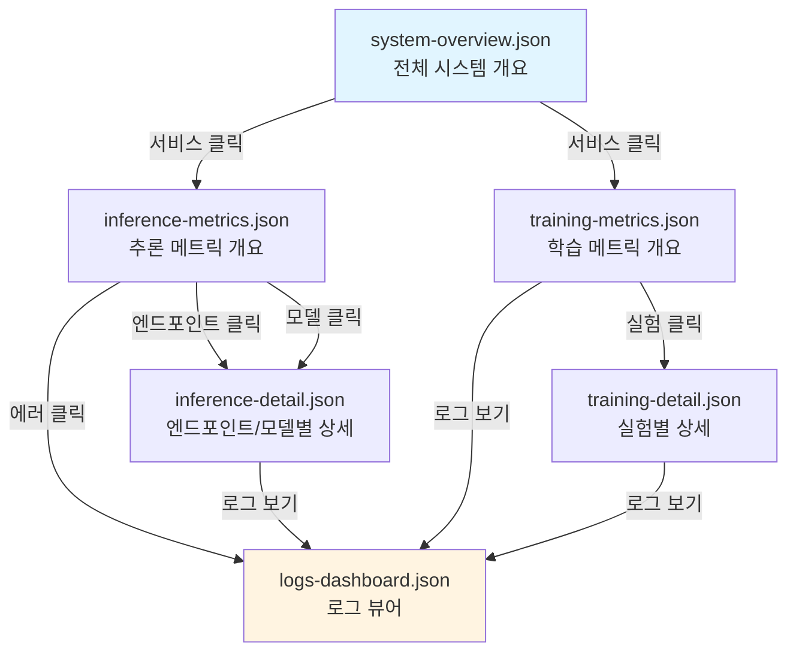

# Grafana 드릴다운 워크플로우 시나리오

> **관련 문서**: [deployment/CLAUDE.md](../../deployment/CLAUDE.md) | [PRD](../../tasks/prd-grafana-drilldown.md)

## 워크플로우 개요



## 시나리오 1: API 응답 시간 급증 조사

### 문제 상황
- 오후 2시경 API 응답 시간이 평소 200ms에서 5초로 급증

### 드릴다운 경로
1. **system-overview.json**
   - "CPU Usage by Service" 패널에서 FastAPI 서비스의 CPU 급증 확인
   - FastAPI 라인 클릭 → "Inference Metrics 보기" 선택
   
2. **inference-metrics.json**
   - 시간 범위가 자동으로 오후 2시 전후로 설정됨
   - "⏱️ HTTP Request Latency (p50, p95, p99)" 패널 확인
   - `/chat` 엔드포인트의 p99가 특히 높음을 발견
   - p99 라인 클릭 → "엔드포인트 상세 보기" 선택

3. **inference-detail.json**
   - URL: `/d/inference-detail?var-endpoint=/chat&from=...&to=...`
   - "🤖 LLM Request Duration by Model" 패널에서 `llama3-8b` 모델만 느린 것 확인
   - "📊 Token Distribution" 패널에서 비정상적으로 큰 요청(4000+ 토큰) 발견
   - "📝 Recent Errors" 패널 클릭 → "전체 로그 보기"

4. **logs-dashboard.json**
   - URL: `/d/logs-dashboard?var-endpoint=/chat&var-model=llama3-8b&from=...&to=...`
   - 필터가 자동 적용되어 해당 엔드포인트/모델 로그만 표시
   - `"error": "CUDA out of memory"` 로그 발견
   - **원인 파악**: 긴 컨텍스트 요청이 GPU 메모리 초과 유발

### 소요 시간
- 드릴다운 사용: **2분**
- 수동 네비게이션 시: **8-10분** (각 대시보드 찾기, 시간대/필터 수동 설정)

---

## 시나리오 2: 특정 모델의 에러율 증가 분석

### 문제 상황
- Slack 알람: llama3-8b 모델의 5xx 에러율이 5% 초과

### 드릴다운 경로
1. **inference-metrics.json**
   - "🤖 LLM Request Rate" 패널에서 `llama3-8b - error` 라인 급증 확인
   - 라인 클릭 → "모델 상세 보기" 선택

2. **inference-detail.json**
   - URL: `/d/inference-detail?var-model=llama3-8b&from=...&to=...`
   - "❌ Error Rate Timeline" 패널에서 14:30부터 에러 시작 확인
   - "📊 Error by Status Code" 패널에서 503 에러가 대부분임을 파악
   - "관련 로그 보기" 클릭

3. **logs-dashboard.json**
   - 503 에러 로그에서 `"vLLM server connection timeout"` 패턴 발견
   - 로그 타임스탬프를 클릭하여 전후 컨텍스트 확인
   - vLLM 서버 재시작 로그 발견 (14:28)
   - **원인 파악**: vLLM 서버 재시작 후 connection pool 고갈

### 액션
- vLLM 서버 connection timeout 설정 증가
- FastAPI의 connection pool max_size 증가

---

## 시나리오 3: 학습 실험 성능 비교

### 목표
- 지난주 실행한 3개의 LoRA fine-tuning 실험 중 최적 설정 찾기

### 드릴다운 경로
1. **training-metrics.json**
   - "📉 Loss by Experiment" 패널에서 3개 실험의 loss curve 확인
   - `exp-20250120-lr1e4` 라인이 가장 낮은 validation loss를 보임
   - 해당 라인 클릭 → "실험 상세 보기"

2. **training-detail.json**
   - URL: `/d/training-detail?var-experiment_id=exp-20250120-lr1e4&...`
   - "📊 Hyperparameters" 패널에서 설정 확인:
     - learning_rate: 1e-4
     - batch_size: 8
     - lora_r: 16
   - "🔥 GPU Utilization" 패널에서 GPU 사용률 80-90% 확인 (효율적)
   - "💾 Checkpoint Timeline" 패널에서 epoch 3의 체크포인트가 최고 성능
   - **결론**: lr=1e-4, batch_size=8이 최적 설정

### 인사이트
- 단일 대시보드에서는 여러 실험 비교만 가능
- 드릴다운으로 특정 실험의 세부 사항 즉시 확인 가능

---

## 시나리오 4: 새 기능 배포 후 안정성 확인

### 상황
- 새로운 `/summarize` 엔드포인트를 배포하고 첫 1시간 모니터링

### 드릴다운 경로
1. **inference-metrics.json**
   - "📊 HTTP Request Rate" 패널에서 `POST /summarize` 라인 확인
   - 요청이 점진적으로 증가 중
   - 라인 클릭 → "엔드포인트 상세 보기"

2. **inference-detail.json**
   - URL: `/d/inference-detail?var-endpoint=/summarize&...`
   - "⏱️ Latency Distribution" 패널에서 p95가 2초 확인 (목표: <3초)
   - "✅ Success Rate" 패널에서 99.8% 확인 (목표: >99%)
   - "🎯 Request Volume" 패널에서 증가 추세 확인
   - **결론**: 성능 목표 달성, 계속 모니터링

### 주기적 확인
- 1시간마다 해당 대시보드 북마크 확인
- 이상 징후 시 "관련 로그 보기"로 즉시 조사

---

## 드릴다운 경로 맵



## 변수 전달 규칙

### 자동 전달되는 변수
| 변수 | 형식 | 예시 |
|------|------|------|
| `from` | Unix timestamp (ms) | `1705737600000` |
| `to` | Unix timestamp (ms) | `1705741200000` |
| `var-endpoint` | URL path | `/chat` |
| `var-model` | Model name | `llama3-8b` |
| `var-status_code` | HTTP status | `500` |
| `var-experiment_id` | Experiment ID | `exp-20250120-lr1e4` |
| `var-run_id` | MLflow run ID | `a3f8d9e2...` |

### URL 템플릿 문법
```
/d/{dashboard-uid}?var-{variable-name}=${__field.labels.{label-name}}&from=${__from}&to=${__to}
```

**예시:**
```
/d/inference-detail?var-endpoint=${__field.labels.endpoint}&from=${__from}&to=${__to}
```

## 베스트 프랙티스

### 1. 컨텍스트 보존
- 항상 `from`, `to` 파라미터 포함
- 드릴다운할 때 부모 대시보드의 필터 상태 전달

### 2. 링크 명명
- 명확한 액션 지향 제목: "엔드포인트 상세 보기" (O) vs "상세" (X)
- 한글 사용으로 접근성 향상

### 3. 로그 연결
- 모든 메트릭 대시보드에서 로그로 드릴다운 가능하도록 설정
- 로그 대시보드는 변수가 비어있을 때도 동작

### 4. 대시보드 계층
```
Level 1 (Overview): 시스템 전체 건강도
Level 2 (Metrics): 서비스/기능별 메트릭
Level 3 (Detail): 특정 엔티티(엔드포인트, 모델, 실험)의 심층 분석
Level 4 (Logs): 원시 로그 데이터
```

## 문제 해결 가이드

### 드릴다운 링크가 작동하지 않을 때
1. Grafana 버전 확인 (>= 9.0)
2. 대시보드 UID가 올바른지 확인
3. 변수명이 대시보드에 정의되어 있는지 확인
4. Prometheus/Loki에 해당 레이블이 존재하는지 확인

### 변수가 전달되지 않을 때
1. URL 파라미터 형식 확인: `var-{name}` (하이픈 필수)
2. `${__field.labels.xxx}` 문법이 올바른지 확인
3. 해당 레이블이 메트릭에 실제로 존재하는지 쿼리로 검증

### 로그가 필터링되지 않을 때
1. Loki LogQL 문법 확인: `| json | field="value"`
2. 변수가 textbox 타입으로 정의되어 있는지 확인
3. 조건부 필터 사용: `field=~"${var:-.+}"`

## 관련 참고 자료

- [Grafana Data Links 공식 문서](https://grafana.com/docs/grafana/latest/panels-visualizations/configure-data-links/)
- [Grafana Variables 가이드](https://grafana.com/docs/grafana/latest/dashboards/variables/)
- [Prometheus 레이블 베스트 프랙티스](https://prometheus.io/docs/practices/naming/)
- [Loki LogQL 튜토리얼](https://grafana.com/docs/loki/latest/logql/)
